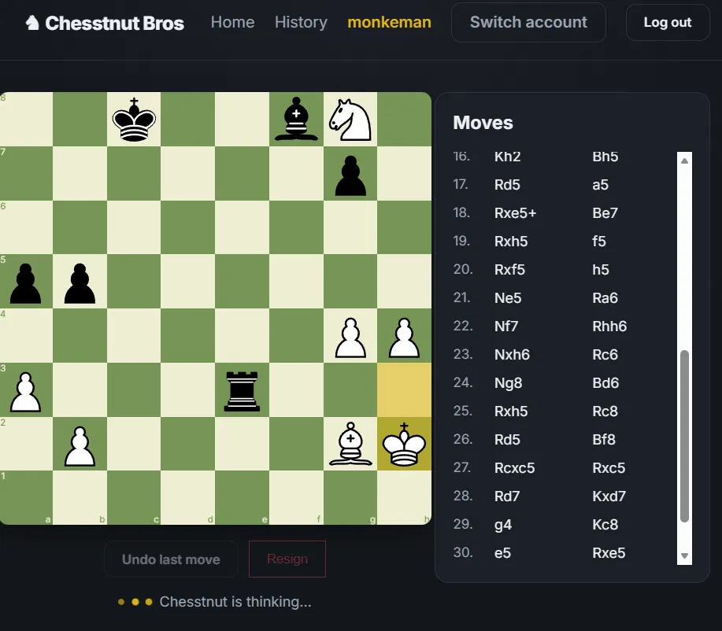

# ♟️ Chesstnut Bros

Play chess against a custom-built engine, right in your browser. Chesstnut Bros pairs a React front end with a FastAPI backend, a from-scratch chess engine, and a hand-rolled C++ key-value store for persistence.



## Features

- **Play vs. the engine** — a custom chess engine (`chesstnut/`) searches for replies via an isolated subprocess worker, so a slow search never blocks the API's event loop.
- **User accounts** — register/login with a username and password (bcrypt-hashed), sessions handled with JWT bearer tokens.
- **Persistent games** — every game is saved per-user in a self built key-value store, so you can leave and come back to an in-progress match.
- **Undo last move** — step back your last move and the engine's reply in one click.
- **Game history & replay** — browse past games and step back through them move by move.

## Tech Stack

| Layer     | Tech |
|-----------|------|
| Client    | React 18, React Router, Vite, [react-chessboard](https://www.npmjs.com/package/react-chessboard), [chess.js](https://www.npmjs.com/package/chess.js) |
| Server    | FastAPI, Uvicorn, httpx, PyJWT, Passlib (bcrypt) |
| Engine    | Custom Python chess engine, run as an isolated worker subprocess |
| Database  | DynamicKV — a custom C++ key-value store |

## Project Structure

```
Chesstnut-Bros/
├── client/          # React + Vite front end
├── server/          # FastAPI backend (auth, game state, engine orchestration)
├── chesstnut/        # Chess engine + search worker
└── dynamicKV/        # Custom C++ key-value store used as the database
```

## Prerequisites

- **Python** 3.10+ with `pip`
- **Node.js** 18+ with `npm`
- A **C++ compiler / Make** toolchain (only needed if you're building DynamicKV from source — a pre-built `dynamickv` binary is included)

## Setup

### 1. Database (DynamicKV)

```bash
cd dynamicKV/DB/src
./dynamickv
```

This starts the key-value store the server uses for persistence, listening on `http://127.0.0.1:8008` by default.

### 2. Server (FastAPI)

```bash
cd server
pip install -r requirements.txt
cp .env.example .env   # adjust values as needed
uvicorn app.main:app --host 127.0.0.1 --port 8000
```

The API will be available at `http://127.0.0.1:8000`, with interactive docs at `http://127.0.0.1:8000/docs`.

### 3. Client (React)

```bash
cd client
npm install
npm run dev
```

The app will be available at `http://localhost:5173`.

> **Note:** Start the services in this order — DynamicKV, then the server, then the client — since the server connects to DynamicKV on startup and the client expects the server to already be running.

## Configuration

Both `server/.env.example` and `client/.env.example` list the available environment variables. Key ones for the server:

| Variable | Default | Description |
|---|---|---|
| `KV_BASE_URL` | `http://127.0.0.1:8008` | Address of the DynamicKV instance |
| `CHESSTNUT_DIR` | `../chesstnut` | Path to the engine directory |
| `ENGINE_WORKER_PATH` | `../chesstnut/engine_worker.py` | Path to the engine's search worker |
| `ENGINE_DEPTH` | `4` | Search depth used by the engine |
| `MAX_SEARCH_WORKERS` | `0` (auto: CPU cores − 1) | Max parallel search worker processes |
| `SEARCH_TIMEOUT_SECONDS` | `25` | Timeout before an engine move request fails |
| `JWT_SECRET` | `dev-secret-change-me` | Secret used to sign auth tokens — change this in production |
| `JWT_EXPIRE_MINUTES` | `1440` | Token lifetime |
| `HOST` / `PORT` | `127.0.0.1` / `8000` | Server bind address |
| `CLIENT_ORIGIN` | `http://localhost:5173` | Allowed CORS origin for the client |

## API Endpoints

All endpoints (except `/register` and `/login`) require an `Authorization: Bearer <token>` header.

| Method | Endpoint | Description |
|---|---|---|
| `POST` | `/register` | Create a new user account. Returns an access token. |
| `POST` | `/login` | Log in with username/password (form data). Returns an access token. |
| `POST` | `/games` | Start a new game for the authenticated user. |
| `GET` | `/games` | List all games belonging to the authenticated user. |
| `GET` | `/games/{game_id}` | Get the full state of a single game. |
| `POST` | `/games/{game_id}/move` | Submit a move (`from_sq`, `to_sq`); the engine replies automatically if the game continues. |
| `POST` | `/games/{game_id}/resign` | Resign the current game. |
| `POST` | `/games/{game_id}/undo` | Undo your last move and the engine's reply to it. |

## How a Move Works

1. The client submits a move via `POST /games/{game_id}/move`.
2. The server validates and applies it against the game's current FEN.
3. If the game isn't over, the move is handed off to the chess engine, which searches for a reply in an isolated worker subprocess (so it doesn't block other requests).
4. The engine's move is applied, the updated game state is persisted to DynamicKV, and both moves plus the new position/evaluation are returned to the client.